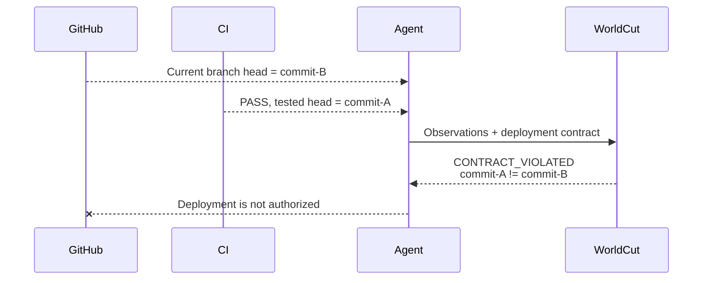
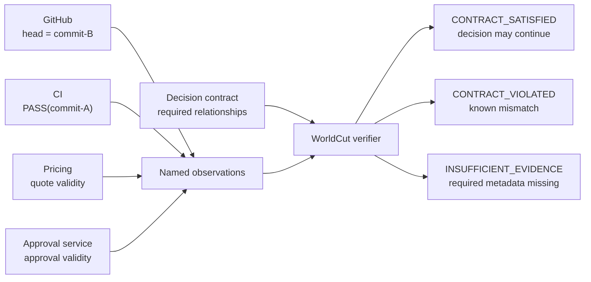
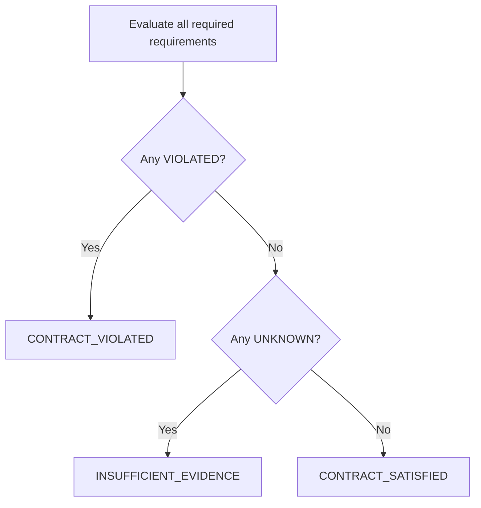
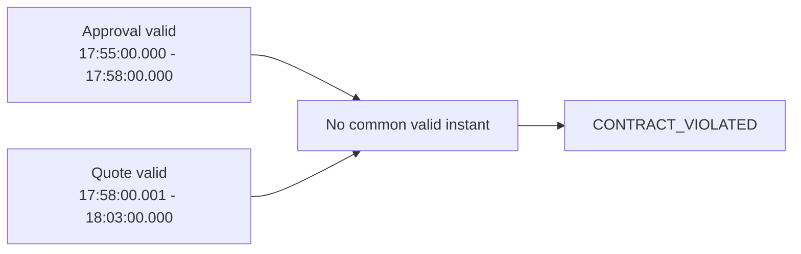

# WorldCut

[](https://github.com/Jason-Doyle/WorldCut/actions/workflows/ci.yml)
[](LICENSE)
[](https://www.npmjs.com/package/worldcut)

WorldCut verifies whether observations from independent systems satisfy the
specific version and time relationships required for a decision.

Install the package:

```sh
npm install worldcut
```

It takes a versioned verification input containing:

1. **Observations** with resource identity, version, validity, and dependency
   metadata.
2. **A decision contract** that states which relationships must hold.

It returns one of three verdicts:

```text
CONTRACT_SATISFIED
CONTRACT_VIOLATED
INSUFFICIENT_EVIDENCE
```

WorldCut does not decide what the contract should be, infer missing
relationships, or claim that a provider is truthful. It evaluates the declared
contract deterministically.

## Production status

WorldCut 0.1 is supported for deterministic decision gating when the documented
metadata, clock, identity, and trusted-process assumptions hold. It fails closed
when required evidence is absent.

It is not a general security boundary or a substitute for provider
authentication, signed provenance, or transactional effect execution. Review
[`docs/PRODUCTION.md`](docs/PRODUCTION.md) before using a satisfied verdict to
authorize a production side effect.

Demonstrated package, GitHub integration, and benchmark evidence is summarized
in [`docs/VALIDATION.md`](docs/VALIDATION.md).

Language-neutral protocol semantics and golden vectors are under
[`spec/0.1`](spec/0.1) and [`conformance/0.1`](conformance/0.1). A required CI
gate additionally runs all four implementations over one shared corpus of golden,
edge, invalid, malformed, and seeded random inputs and compares their complete
results, as described in
[`docs/DIFFERENTIAL.md`](docs/DIFFERENTIAL.md).

## Implementations

| Port | Protocol / engine | Status |
| --- | --- | --- |
| TypeScript | 0.1 / 0.1.2 | Reference package with documented integrations |
| [Go](ports/go) | 0.1 / 0.1.2 | Independent conformant verifier and CLI; integrations not yet included |
| [Python](ports/python) | 0.1 / 0.1.2 | Independent conformant verifier and CLI; integrations not yet included |
| [.NET](ports/dotnet) | 0.1 / 0.1.2 | [`WorldCut`](https://www.nuget.org/packages/WorldCut/0.1.1) library and [`WorldCut.Tool`](https://www.nuget.org/packages/WorldCut.Tool/0.1.1) CLI for .NET 8 and .NET 10 |

Go is available through its public module tag, and .NET `0.1.1` is live on
NuGet.org. Python `0.1.1` is built and its trusted-publishing workflow is ready,
but the PyPI publisher still needs to be activated before that registry release.

Registry release configuration is documented in
[`docs/PORT_RELEASES.md`](docs/PORT_RELEASES.md).

Every port passes the committed vectors, and the
[cross-language differential suite](docs/DIFFERENTIAL.md) checks that they still
agree with the TypeScript reference on inputs no vector covers:

```sh
npm run differential
```

## Run the examples

```sh
git clone https://github.com/Jason-Doyle/WorldCut.git
cd WorldCut
npm ci
npm run examples
```

Output:

```text
Fixture                     Verdict
--------------------------  ---------------------
coherent-deployment.json    CONTRACT_SATISFIED
git-ci-mismatch.json        CONTRACT_VIOLATED
temporal-gap.json           CONTRACT_VIOLATED
missing-evidence.json       INSUFFICIENT_EVIDENCE
```

Run one verification:

```sh
npm run verify -- examples/git-ci-mismatch.json
```

Use `--require-satisfied` in automation. It exits with code `2` when the
contract is violated or evidence is insufficient:

```sh
npm run verify -- examples/coherent-deployment.json --require-satisfied
```

## What problem does this solve?

An agent can combine individually correct responses into a conclusion that the
responses do not support.



Nothing in either provider response is necessarily false:

- the branch currently points to `commit-B`;
- the CI run really passed;
- that CI run tested `commit-A`.

The unsupported step is joining those facts into “`commit-B` passed CI.”

Ordinary freshness checks cannot detect that error. Exact dependency checking
can detect this example, but it cannot express every relationship a decision
may require, such as whether conditions from independent providers were valid
at a common time.

## How WorldCut fits into a decision path



WorldCut evaluates only the selected observations and contract. It does not
fetch every provider itself or maintain a global database snapshot.

## Verification model

### 1. Bind observations to named roles

Contracts refer to roles such as `head`, `ci`, `approval`, and `quote`.
At most one observation may be bound to a role. If a required role has no
observation, its requirement is `UNKNOWN` and the aggregate verdict is
`INSUFFICIENT_EVIDENCE`.

Each resource identity has four independently compared components:

```text
provider + account + kind + key
```

This prevents a version from one repository, tenant, or provider from being
treated as a version of another resource.

### 2. Evaluate each requirement

WorldCut 0.1 supports three requirement types.

| Requirement | Question |
| --- | --- |
| `dependency` | Did one observation depend on the exact selected version of another resource? |
| `common_valid_time` | Did all named observations share a non-empty valid interval inside the contract window? |
| `value_equals` | Does a deterministic JSON value path equal the required value? |

Every required check returns:

| Result | Meaning |
| --- | --- |
| `SATISFIED` | Available metadata establishes the requirement |
| `VIOLATED` | Available metadata establishes that the requirement is false |
| `UNKNOWN` | A required observation or witness is missing |

### 3. Aggregate conservatively



An unknown requirement never becomes implicit permission.

### 4. Produce an auditable result

The result contains:

- requirement-level statuses and explanations;
- coverage counts;
- bounded acquisition options for missing or mismatched evidence;
- a deterministic digest of the verification record.

The acquisition plan identifies evidence that could be refreshed or acquired.
It is not a guarantee that refreshing the world will make the contract pass.
The digest detects record changes; it is not a digital signature.

## Concrete example: wrong CI revision

The contract requires the CI observation to identify the same branch-head
version selected for deployment:

```json
{
  "id": "ci-tested-current-head",
  "type": "dependency",
  "description": "The passing CI run tested the selected branch head",
  "dependentRole": "ci",
  "targetRole": "head",
  "dependencyName": "tested_head"
}
```

The selected observations say:

```text
head.witness.version                 = commit-B
ci.witness.dependencies.tested_head = commit-A
```

Relevant fields from the CLI output:

```json
{
  "contractId": "deploy-current-tested-head",
  "verdict": "CONTRACT_VIOLATED",
  "coverage": {
    "required": 1,
    "satisfied": 0,
    "violated": 1,
    "unknown": 0,
    "advisory": 0
  },
  "requirements": [
    {
      "id": "ci-tested-current-head",
      "status": "VIOLATED",
      "summary": "The passing CI run tested the selected branch head: commit-A does not equal commit-B."
    }
  ]
}
```

Run it:

```sh
npm run verify -- examples/git-ci-mismatch.json
```

## Concrete example: fresh records that never coexisted

The approval and quote are both fetched immediately before the decision, but
their declared valid intervals do not overlap:



A TTL check sees two fresh reads and passes. WorldCut evaluates the contract's
`common_valid_time` requirement and rejects the decision.

```sh
npm run verify -- examples/temporal-gap.json
```

## Concrete example: missing dependency metadata

The CI provider says the run passed but does not identify which revision it
tested. WorldCut cannot prove a mismatch, but it also cannot authorize the
deployment. Relevant output:

```json
{
  "verdict": "INSUFFICIENT_EVIDENCE",
  "requirements": [
    {
      "id": "ci-tested-current-head",
      "status": "UNKNOWN",
      "summary": "ci does not expose dependency tested_head."
    }
  ]
}
```

```sh
npm run verify -- examples/missing-evidence.json
```

## Concrete example: satisfied release evidence

`examples/coherent-deployment.json` combines all three supported requirement
types:

- the CI run is bound to `commit-B`, which is the selected branch head;
- the CI status equals `passed`;
- the approval and quote share a valid time inside the decision window.

```sh
npm run verify -- examples/coherent-deployment.json --require-satisfied
```

The result is `CONTRACT_SATISFIED`.

## What WorldCut checks—and what it does not

| Concern | WorldCut behavior |
| --- | --- |
| “Was this observation fetched recently?” | Records `observedAt`, but freshness alone is not authorization |
| “Did CI test this exact selected revision?” | Supported through an exact dependency requirement |
| “Were these conditions valid together?” | Supported through a scoped common-valid-time requirement |
| “Is required metadata missing?” | Returns `INSUFFICIENT_EVIDENCE` |
| “Which evidence could be reacquired?” | Returns a bounded acquisition plan |
| “Is the provider telling the truth?” | Not established |
| “What relationships should the business require?” | Supplied by the caller's contract |
| “Can multiple providers be frozen transactionally?” | Not attempted |
| “Is the result cryptographically signed?” | No; the record contains a deterministic digest only |

## Metadata adapters

The included adapters capture native resource-version material:

| Adapter | Exact version witness | Important limitation |
| --- | --- | --- |
| Git | Commit SHA for an exact local branch ref | Another system must still declare its dependency on that SHA |
| HTTP | Syntactically valid strong `ETag` | Weak ETags and `Last-Modified` are descriptive only |
| Kubernetes | Opaque `metadata.resourceVersion` | Clients must not interpret or sort the value |

These adapters do not manufacture dependency or validity relationships that a
provider does not expose.

```sh
npm run feasibility
```

Set `WORLDCUT_SAMPLE_GIT_REPO` to inspect another local Git repository.

## GitHub Actions deployment gate

The package includes a production-oriented gate for the latest completed
`push` run of an exact workflow file or workflow ID:

```sh
worldcut-github-ci \
  --repository acme/payments \
  --branch main \
  --workflow ci.yml
```

The gate verifies both:

- the latest completed run concluded with `success`;
- its `head_sha` equals the branch head observed after the run lookup.

On success it returns `verifiedSha`. Deployment code must consume that exact
SHA or an immutable artifact built from it—never re-resolve the branch name.

In GitHub Actions the CLI writes `verified_sha` and `workflow_run_id` to
`GITHUB_OUTPUT`. See
[`examples/github-actions/deployment-gate.yml`](examples/github-actions/deployment-gate.yml)
and [`docs/INTEGRATIONS.md`](docs/INTEGRATIONS.md).

## Agentic Data Kernel

`observationFromAgenticDataResolution` converts an eligible Agentic Data Kernel
resolution into a WorldCut observation without adding a runtime package
dependency.

The adapter rejects unresolved conflicts, inactive assertions, assertions
outside the selected system or valid time, and cross-tenant resource claims.
See
[`docs/AGENTIC_DATA_KERNEL.md`](docs/AGENTIC_DATA_KERNEL.md)
for the namespaced `basis.worldcut` contract and effect-gating guidance.

## JSON Schemas

Immutable protocol 0.1 schemas are published with the package:

```text
worldcut/schemas/0.1/verification-input.json
worldcut/schemas/0.1/verification-result.json
```

Schema validation checks the transport shape. Runtime verification remains
required for invariants such as unique role bindings, interval ordering, and
observation timing.

## CLI

```text
Usage: worldcut <verification.json> [options]

Options:
  --full               Print the complete verification result
  --require-satisfied  Exit with code 2 unless the contract is satisfied
  --help               Show help
```

Through npm:

```sh
npm run verify -- examples/git-ci-mismatch.json --full
```

Exit codes:

| Code | Meaning |
| ---: | --- |
| `0` | Input was valid; or `--require-satisfied` received a satisfied contract |
| `1` | Input, file, or runtime error |
| `2` | `--require-satisfied` received a non-satisfied verdict |

Errors use a stable JSON envelope on stderr:

```json
{"error":{"code":"WORLDCUT_INVALID_INPUT","message":"..."}}
```

## Evaluation

The repository includes an independent event-history simulator and comparison
strategies for latest-value selection, TTL freshness, permissive and strict
dependency checks, and equivalent hand-written predicates.

Across 16,000 generated decisions:

- WorldCut produced no false authorizations with complete, truthful metadata;
- it authorized every safe complete-metadata case;
- strict dependency-only validation still authorized 676 and 976 unsafe cases
  in the two complete-metadata profiles because it ignored the scoped temporal
  requirement;
- equivalent hand-written predicates produced exactly the same verdicts as
  WorldCut;
- weak metadata caused 3,505 abstentions in 4,000 trials.

The result supports a limited claim: freshness and exact dependency checks do
not express every cross-service compatibility requirement. It does not prove
that WorldCut is better than equivalent application code, that production APIs
expose enough metadata, or that the acquisition planner lowers operational
cost.

```sh
npm run benchmark
```

Detailed generated results are written to `benchmark/` and excluded from
version control.

## Development

Requires Node.js 22.19 or newer.

```sh
npm ci
npm run check
npm run examples
npm run benchmark
```

The project uses the Node.js test runner and has no runtime dependencies.

The conformance corpus is checked with Node.js:

```sh
npm run conformance:check
```

Cross-language work additionally needs Go, Python, and .NET toolchains:

```sh
npm run differential
```

`npm run differential` builds each port's CLI once and compares all four
implementations over one shared corpus. Its seed, case count, and executable
overrides are documented in
[`docs/DIFFERENTIAL.md`](docs/DIFFERENTIAL.md).

Protocol details and runtime assumptions are documented in
[`docs/PROTOCOL.md`](docs/PROTOCOL.md). Production deployment requirements are
documented in [`docs/PRODUCTION.md`](docs/PRODUCTION.md).

## Scope

WorldCut has a deliberately narrow production contract. It is not:

- a distributed transaction manager;
- a source-of-truth database;
- a cryptographic attestation system;
- a same-process JavaScript security boundary;
- proof that provider metadata is complete or truthful.

## Contributing

See [`CONTRIBUTING.md`](CONTRIBUTING.md). Security reports should follow
[`SECURITY.md`](SECURITY.md).

## License

Apache License 2.0.
